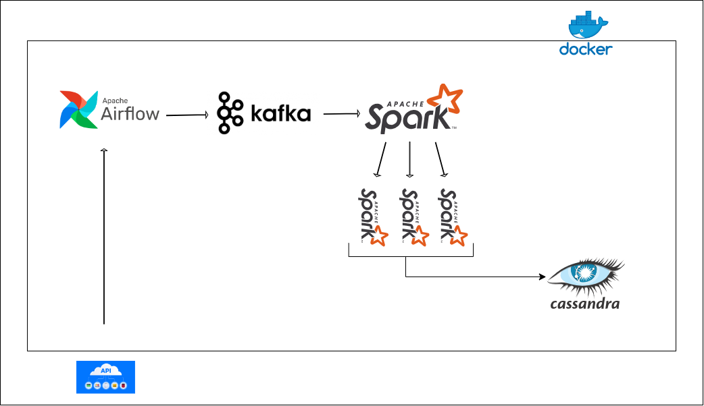

# STREAMING DATA IN REAL TIME PROJECT

In this project, data ingestion from diverse APIs is initiated, followed by data cleansing and manipulation using Python. The orchestration of data flow is facilitated by Apache Airflow, directing the data to Kafka. Subsequently, Kafka streams the data to Spark Master, which governs the Spark workers. Finally, the Spark workers transmit the data to Cassandra for storage and further analysis.

## Hardware requirement to run this project 

Running this project on a single machine will necessitate robust hardware specifications.
Here's a minimum requirement:

- Processor: Opt for a multi-core CPU with a minimum of 4 cores to effectively manage the services used in the project.
- Memory (RAM): I recommend a baseline of 8GB RAM, though 16GB ensures smoother operations.
- Storage: Consider utilizing SSD storage for improved performance. Allocate a minimum of 100GB of free disk space to accommodate data storage, logs, and other essentials.

## Technologies used in this project

- Python
- Docker and docker compose
- Apache Airflow
- Cassandra
- Apache Kafka
- Apache Zookeeper
- PostgreSQL
- Apache Spark

